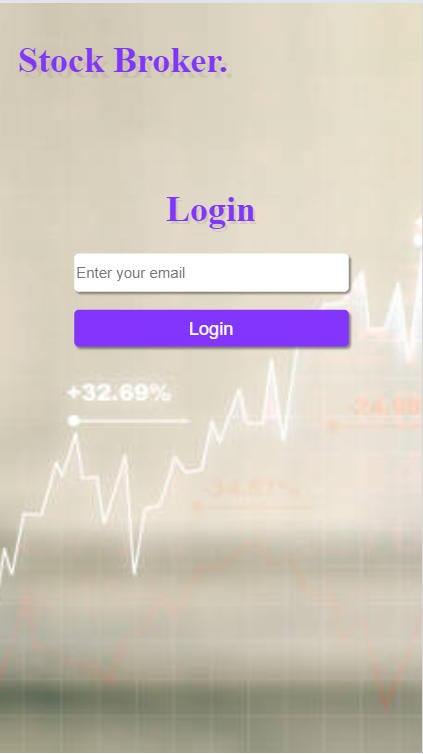
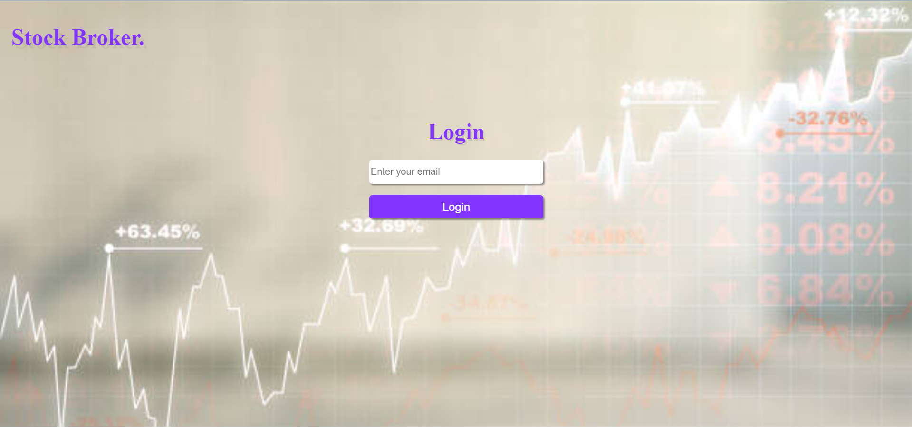
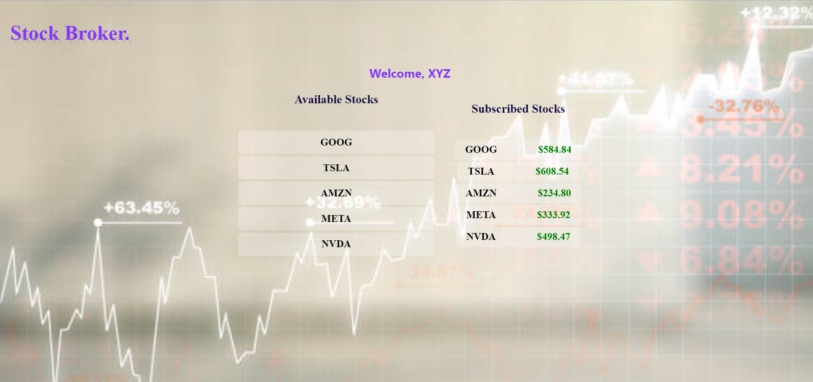

## Stock Broker Client Web Dashboard

This project is a real-time stock broker client web dashboard that allows users to subscribe to stock tickers and receive live price updates. The application demonstrates the use of WebSockets for real-time communication between the backend server and the frontend client.

## Features

- User login using email.
- Subscribe to supported stocks (e.g., GOOG, TSLA, AMZN, META, NVDA).
- Real-time stock price updates without refreshing the dashboard.
- Support for multiple users who can subscribe to different stocks.
- Simultaneous updates for all users subscribed to the same stock.

### Screenshorts







## Technologies Used

- **Frontend**: React, Vite, Socket.io-client
- **Backend**: Node.js, Express, Socket.io

## Installation

Follow these steps to set up and run the project locally.

### Prerequisites

- Node.js and npm installed on your machine.

### Backend Setup

1. Clone the repository and navigate to the backend directory:
   ```sh
   git clone https://github.com/riyaj-kalegar03/Assignment-2.git
   cd Assignment-2
   cd stock-broker-server
   ```
2. Install the backend dependencies:

   npm install

3. Start the backend server:

   node server.js

### Frontend Setup

1. Navigate to the frontend directory:

   cd stock-broker-dashboard  (/Assignment-2/stock-broker-dashboard)

2. Install the frontend dependencies:

   npm install

3. Start the frontend development server:

   npm run dev

## Running the Application

1. Ensure the backend server is running:

   node server.js

2. In a separate terminal, start the frontend development server:

   npm run dev

3. Open your browser and navigate to http://localhost:5173.

## Project Structure

stock-broker-dashboard/
├── backend/
│ ├── server.js
│ └── package.json
├── frontend/
│ ├── src/
│ │ ├── components/
│ │ │ ├── Dashboard.jsx
│ │ │ └── Stock.jsx
│ │ ├── socket.js
│ │ ├── App.jsx
│ │ └── main.jsx
│ ├── index.html
│ ├── package.json
│ └── vite.config.js
└── README.md

### Explanation of Functionality

1. User A subscribes to AMZN:

   - When User A clicks the subscribe button for AMZN, the frontend emits a subscribe event to the backend via the Socket.io connection.
   - The backend adds User A to the AMZN room.

2. Backend emits price updates:

   - The backend continuously emits price updates for all stocks every second.
   - These updates are sent to all clients connected to the corresponding stock rooms.

3. User B subscribes to AMZN:

   - When User B subscribes to AMZN, they are also added to the AMZN room.

   * Both User A and User B receive the same real-time price updates for AMZN since they are in the same room.

4. Frontend displays price updates:

   - The frontend listens for priceUpdate events and updates the state with the new prices.
   - The updated prices are rendered in the Stock component, ensuring both users see the same prices simultaneously.

## Contributions

    Feel free to submit issues and pull requests to help improve this project.
